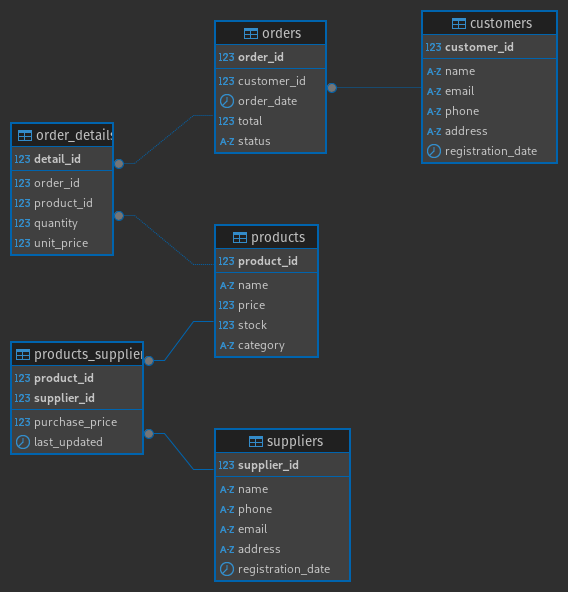

# Clothing Store Database Schema

This repository contains the SQL script to create and define the schema for a clothing store database. The schema is designed to handle customers, products, orders, suppliers, and their relationships effectively.

## Schema Overview

The schema includes the following tables:

1. **`customers`**: Stores information about customers, including their name, email, phone number, address, and registration date.
2. **`products`**: Contains details about products available in the store, including their name, description, price, stock, and category.
3. **`orders`**: Records customer orders, including the total amount, order date, and status.
4. **`order_details`**: Represents the items in each order, including quantity, unit price, and subtotal.
5. **`suppliers`**: Stores supplier details such as name, phone, email, and address.
6. **`products_suppliers`**: Defines the many-to-many relationship between products and suppliers, including the purchase price and last updated timestamp.

## Script Details

The `Create_Schema.sql` script includes the following:

### Create Schema
```sql
CREATE SCHEMA clothing_store;
```
This initializes the `clothing_store` schema where all tables are defined.

### Create Tables

#### `customers`
Defines the customers of the clothing store.
```sql
CREATE TABLE clothing_store.customers (
    customer_id SERIAL PRIMARY KEY,
    name VARCHAR(100) NOT NULL,
    email VARCHAR(150) UNIQUE NOT NULL,
    phone VARCHAR(15),
    address TEXT,
    registration_date TIMESTAMP DEFAULT CURRENT_TIMESTAMP
);
```

#### `products`
Defines the store's products.
```sql
CREATE TABLE clothing_store.products (
    product_id SERIAL PRIMARY KEY,
    name VARCHAR(100) NOT NULL,
    description TEXT,
    price NUMERIC(10, 2) NOT NULL,
    stock INT DEFAULT 0,
    category VARCHAR(50)
);
```

#### `orders`
Tracks orders placed by customers.
```sql
CREATE TABLE clothing_store.orders (
    order_id SERIAL PRIMARY KEY,
    customer_id INT NOT NULL,
    order_date TIMESTAMP DEFAULT CURRENT_TIMESTAMP,
    total NUMERIC(10, 2) NOT NULL,
    status VARCHAR(20) DEFAULT 'Pending',
    FOREIGN KEY (customer_id) REFERENCES clothing_store.customers(customer_id)
);
```

#### `order_details`
Details the items within an order.
```sql
CREATE TABLE clothing_store.order_details (
    detail_id SERIAL PRIMARY KEY,
    order_id INT NOT NULL,
    product_id INT NOT NULL,
    quantity INT NOT NULL,
    unit_price NUMERIC(10, 2) NOT NULL,
    subtotal NUMERIC(10, 2) GENERATED ALWAYS AS (quantity * unit_price) STORED,
    FOREIGN KEY (order_id) REFERENCES clothing_store.orders(order_id),
    FOREIGN KEY (product_id) REFERENCES clothing_store.products(product_id)
);
```

#### `suppliers`
Defines suppliers who provide products.
```sql
CREATE TABLE clothing_store.suppliers (
    supplier_id SERIAL PRIMARY KEY,
    name VARCHAR(100) NOT NULL,
    phone VARCHAR(15),
    email VARCHAR(150),
    address TEXT,
    registration_date TIMESTAMP DEFAULT CURRENT_TIMESTAMP
);
```

#### `products_suppliers`
Defines the many-to-many relationship between products and suppliers.
```sql
CREATE TABLE clothing_store.products_suppliers (
    product_id INT NOT NULL,
    supplier_id INT NOT NULL,
    purchase_price NUMERIC(10, 2) NOT NULL,
    last_updated TIMESTAMP DEFAULT CURRENT_TIMESTAMP,
    PRIMARY KEY (product_id, supplier_id),
    FOREIGN KEY (product_id) REFERENCES clothing_store.products(product_id),
    FOREIGN KEY (supplier_id) REFERENCES clothing_store.suppliers(supplier_id)
);
```
## Schema



## Usage

1. Clone this repository to your local environment.
2. Run the `Create_Schema.sql` script in your preferred SQL database environment (e.g., PostgreSQL).
3. Customize or extend the schema as needed for your application.

## Key Points to Remember
- **Referential Integrity:** Make sure **customer_id**, **order_id**, **product_id**, and **supplier_id** match valid records in the respective tables to satisfy foreign key constraints.
- **Default Values:** Columns like **registration_date** and **order_date** have default values, so you can omit them unless you need to override the defaults.