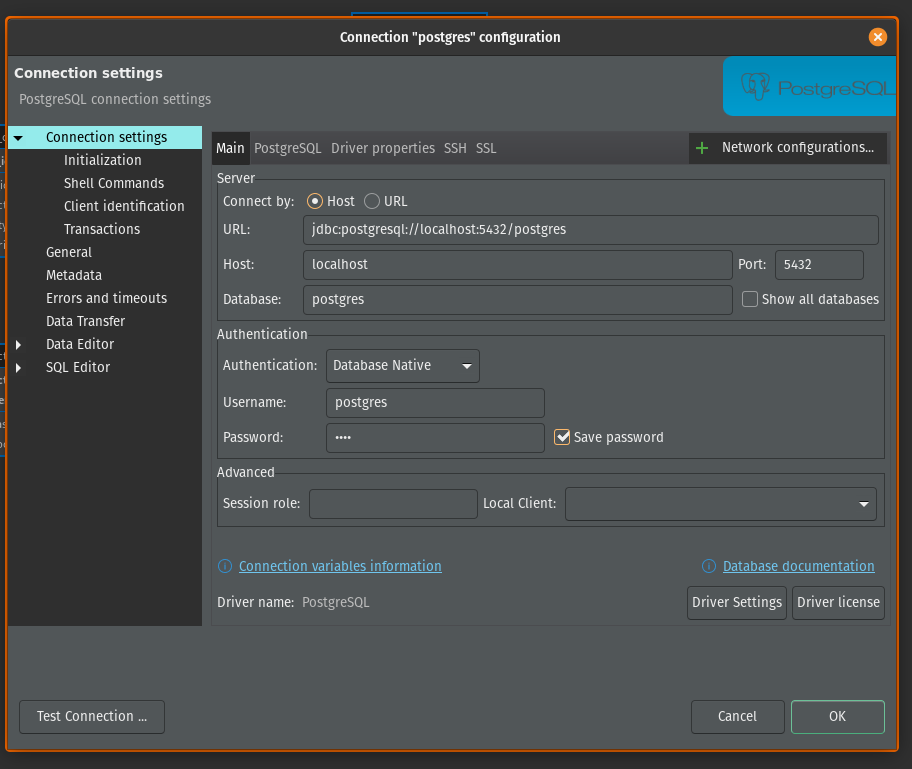
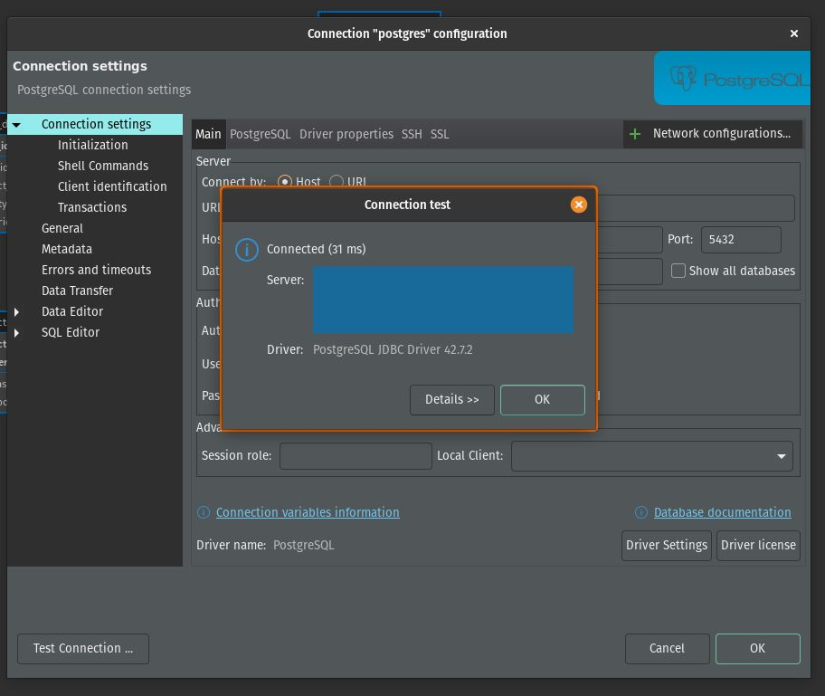

# <u>Clothing Store Database Schema</u>

This repository contains the SQL script to create and define the schema for a clothing store database. The schema is designed to handle customers, products, orders, suppliers, and their relationships effectively.

## <u>Schema Overview</u>

The schema includes the following tables:

1. **<u>`customers`</u>**: Stores information about customers, including their name, email, phone number, address, and registration date.
2. **<u>`products`</u>**: Contains details about products available in the store, including their name, description, price, stock, and category.
3. **<u>`orders`</u>**: Records customer orders, including the total amount, order date, and status.
4. **<u>`order_details`</u>**: Represents the items in each order, including quantity, unit price, and subtotal.
5. **<u>`suppliers`</u>**: Stores supplier details such as name, phone, email, and address.
6. **<u>`products_suppliers`</u>**: Defines the many-to-many relationship between products and suppliers, including the purchase price and last updated timestamp.

## <u>Connection</u>

1. In this case, we are going to use DBeaver, so the first thing we need to do is create a new connection.
- As shown in the picture, we need to configure the following settings:
    - **<u>Host</u>:** localhost
    - **<u>Database</u>:** postgres
    - **<u>Port</u>:** 5432
    - **<u>Username</u>:** postgres
    - **<u>Password</u>:** _YOUR PASSWORD_
<br>



2. After setting the parameters, we should test the connection to ensure it works before applying the configuration.

<br>



## <u>Script Details</u>

The **`Create_Schema.sql`** script includes the following:

### <u>Create Schema</u>
```sql
CREATE SCHEMA clothing_store;
```
This initializes the **`clothing_store`** schema where all tables are defined.

### <u>Create Tables</u>

#### <u>`customers`</u>
Defines the customers of the clothing store.
```sql
CREATE TABLE clothing_store.customers (
    customer_id SERIAL PRIMARY KEY,
    name VARCHAR(100) NOT NULL,
    email VARCHAR(150) UNIQUE NOT NULL,
    phone VARCHAR(15),
    address TEXT,
    registration_date TIMESTAMP DEFAULT CURRENT_TIMESTAMP
);
```

#### <u>`products`</u>
Defines the store's products.
```sql
CREATE TABLE clothing_store.products (
    product_id SERIAL PRIMARY KEY,
    name VARCHAR(100) NOT NULL,
    description TEXT,
    price NUMERIC(10, 2) NOT NULL,
    stock INT DEFAULT 0,
    category VARCHAR(50)
);
```

#### <u>`orders`</u>
Tracks orders placed by customers.
```sql
CREATE TABLE clothing_store.orders (
    order_id SERIAL PRIMARY KEY,
    customer_id INT NOT NULL,
    order_date TIMESTAMP DEFAULT CURRENT_TIMESTAMP,
    total NUMERIC(10, 2) NOT NULL,
    status VARCHAR(20) DEFAULT 'Pending',
    FOREIGN KEY (customer_id) REFERENCES clothing_store.customers(customer_id)
);
```

#### <u>`order_details`</u>
Details the items within an order.
```sql
CREATE TABLE clothing_store.order_details (
    detail_id SERIAL PRIMARY KEY,
    order_id INT NOT NULL,
    product_id INT NOT NULL,
    quantity INT NOT NULL,
    unit_price NUMERIC(10, 2) NOT NULL,
    subtotal NUMERIC(10, 2) GENERATED ALWAYS AS (quantity * unit_price) STORED,
    FOREIGN KEY (order_id) REFERENCES clothing_store.orders(order_id),
    FOREIGN KEY (product_id) REFERENCES clothing_store.products(product_id)
);
```

#### <u>`suppliers`</u>
Defines suppliers who provide products.
```sql
CREATE TABLE clothing_store.suppliers (
    supplier_id SERIAL PRIMARY KEY,
    name VARCHAR(100) NOT NULL,
    phone VARCHAR(15),
    email VARCHAR(150),
    address TEXT,
    registration_date TIMESTAMP DEFAULT CURRENT_TIMESTAMP
);
```

#### <u>`products_suppliers`</u>
Defines the many-to-many relationship between products and suppliers.
```sql
CREATE TABLE clothing_store.products_suppliers (
    product_id INT NOT NULL,
    supplier_id INT NOT NULL,
    purchase_price NUMERIC(10, 2) NOT NULL,
    last_updated TIMESTAMP DEFAULT CURRENT_TIMESTAMP,
    PRIMARY KEY (product_id, supplier_id),
    FOREIGN KEY (product_id) REFERENCES clothing_store.products(product_id),
    FOREIGN KEY (supplier_id) REFERENCES clothing_store.suppliers(supplier_id)
);
```
## <u>Schema</u>


## <u>Usage</u>

1. Clone this repository to your local environment.
2. Run the **`Create_Schema.sql`** script in your preferred SQL database environment (e.g., PostgreSQL).
3. Customize or extend the schema as needed for your application.

# <u>Python</u>

## <u>Data Generation Script</u>

- A Python script **`generate_customers_data.py`** is included to generate sample data for the **`customers`** table.

- A Python script **`generate_orders_data.py`** is included to generate sample data for the **`orders`** table.

- A Python script **`generate_orders_details_data.py`** is included to generate sample data for the **`details_orders`** table.

- A Python script **`generate_product_data.py`** is included to generate sample data for the **`products`** table.

- A Python script **`generate_product_suppliers_data.py`** is included to generate sample data for the **`product_suppliers`** table.

- A Python script **`generate_suppliers_data.py`** is included to generate sample data for the **`suppliers`** table.

### <u>Script Overview</u>

These scripts uses the **`Faker`** library to generate realistic customer data, ensuring unique values for IDs, names, emails, phone numbers, addresses, and registration dates. The generated data is formatted as SQL **`INSERT`** statements.

## <u>Usage</u>

1. Install the required library: **`pip install faker`**
2. Run the scripts: 
- **`python generate_customers_data.py`**
- **`python generate_orders_data.py`**
- **`python generate_orders_details_data.py`**
- **`python generate_product_data.py`**
- **`python generate_product_suppliers_data.py`**
- **`python generate_suppliers_data.py`**
3. Copy the generated SQL output and execute it in your database environment.

## <u>Key Points to Remember</u>
- **<u>Referential Integrity</u>:** Make sure **customer_id**, **order_id**, **product_id**, and **supplier_id** match valid records in the respective tables to satisfy foreign key constraints.
- **<u>Default Values</u>:** Columns like **registration_date** and **order_date** have default values, so you can omit them unless you need to override the defaults.

## <u>Documentation</u>

- [Postgres Documentation](https://www.postgresql.org/docs/)
- [Faker Documentation](https://faker.readthedocs.io/en/master/)
- [Random Documentation](https://docs.python.org/3/library/random.html)
- [Psycopg Documentation](https://www.psycopg.org/docs/)
- [Pandas Documentation](https://pandas.pydata.org/docs/)

## <u>Sources</u>

- [DBeaver Community](https://dbeaver.io/download/)
- [Install Docker Desktop on Linux](https://docs.docker.com/desktop/setup/install/linux/)
- [Visual Studio Code](https://code.visualstudio.com/download)
- [Alacritty](https://github.com/alacritty/alacritty)

## <u>Contributions</u>

Contributions are welcome! Feel free to submit issues or pull requests to enhance the functionality.