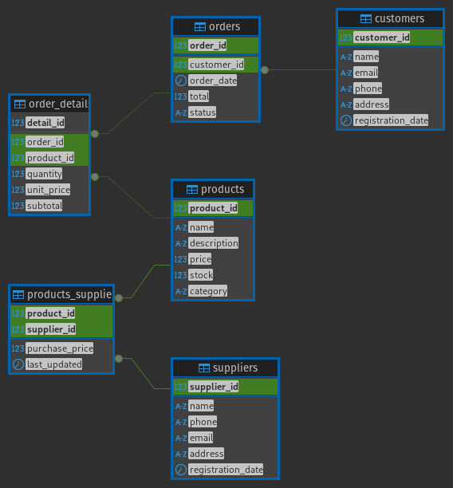

# Postgres Clothing Store Database

## Table Descriptions:
- **Customers:** Stores customer information, such as name, email, phone, and address.
- **Products:** Defines the products the store sells, including details like name, description, price, and stock.
- **Orders:** Stores orders placed by customers, including the date, total amount, and order status.
- **Order Details:** Links products with orders, including information about quantity and prices.
- **Suppliers:** Stores information about product suppliers, such as name, phone, and address.
- **Products-Suppliers:** Manages the many-to-many relationship between products and suppliers, including purchase prices and update timestamps.

## Schema

